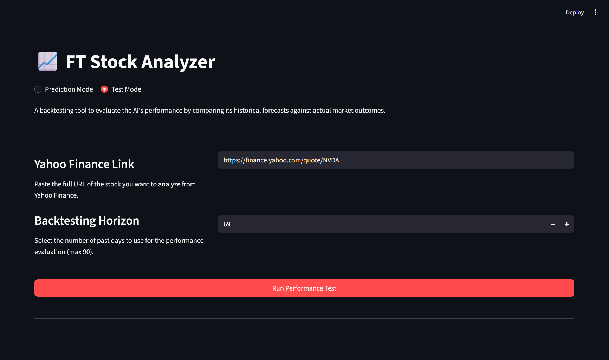
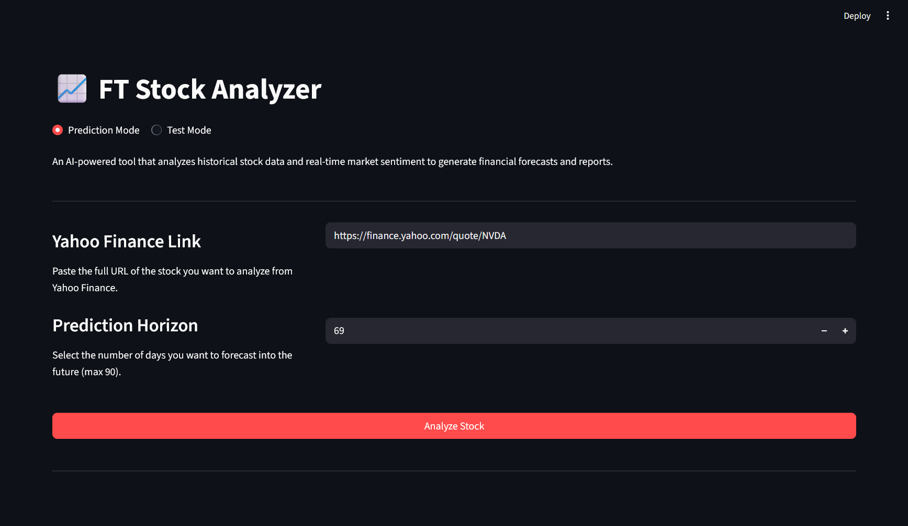

# 📈 FT Stock Analyzer: A Multi-Model LLM Pipeline for Financial Analysis

## Abstract
This description documents the design, development, and iteration of a multi-stage AI pipeline for financial analysis, built to run on consumer-grade hardware. The primary objective was to synthesize quantitative time-series forecasts with qualitative news sentiment analysis to produce human-like analyst reports. The project evolved through two key phases: an initial single-stock Proof of Concept (PoC) developed in Jupyter Notebooks, which validated the core 3-instance architecture; and a subsequent generalization phase, which involved building scalable data pipelines, fine-tuning smaller, specialized models on a massive dataset of ~6,800 stocks, and engineering a final multi-model orchestration script. Key challenges, including severe hardware memory constraints, API limitations, and model behavior debugging, were systematically overcome, resulting in a robust, end-to-end application pipeline served via a FastAPI backend and a Streamlit frontend.

---

## 1. Introduction

### 1.1. Problem Statement
Financial market prediction is an inherently complex task that requires the synthesis of two distinct types of information: quantitative historical data (stock prices, volume) and qualitative, unstructured data (news headlines, market sentiment). While traditional algorithmic models excel at the former and human analysts at the latter, a significant challenge lies in creating an automated system that can effectively merge both streams of analysis into a single, coherent, and actionable report. This project explores the feasibility of using a pipeline of Large Language Models (LLMs) to achieve this synthesis, with the added constraint of operating on consumer-grade hardware with limited GPU VRAM (4GB).

### 1.2. Proposed Solution & Architecture
The proposed solution is a 3-instance sequential pipeline where each stage performs a specialized task. This modular, sequential design is critical for managing memory on a constrained GPU.

#### Instance 1: The Forecaster. 
Instance 1 is a fine-tuned Large Language Model (LLM) specialized in analyzing historical price data to produce a numerical forecast. Following the methodology of recent research in time-series analysis with LLMs, this instance treats forecasting not as a traditional regression problem, but as a sequence-to-sequence text generation task.

The core of this approach is the transformation of raw numerical data into a rich, structured text prompt that an LLM can understand and reason with. The historical price data, a sequence of numbers, is first transformed into a string format (e.g., DATA: [150.25, 151.30, ...]).

This numerical string is then embedded within a prompt that provides critical context to the model, including:

* **Task Definition:** Explicitly stating the goal (e.g., TASK: Time Series Forecast).

* **Summary Statistics:** Providing pre-calculated metrics like the mean, standard deviation, and recent trend of the historical data.This aligns with research showing that LLMs perform better when key statistical features are highlighted for them.

* **Dynamic Context:** The prompt explicitly states the CONTEXT_DAYS being used. During training, this value was randomized, teaching the model the relationship between different historical time windows and prediction horizons.

The FreedomIntelligence/TinyDeepSeek-0.5B-base model was then fine-tuned on a massive dataset of over 4 million of these prompts, generated from the histories of ~6,800 different stocks. The primary goal of this fine-tuning was to teach the model a single, specialized skill: when it sees the final PREDICTION: token, it must suppress its default conversational behavior and generate only a clean, parsable list of numerical values. This approach effectively "reprograms" a general-purpose language model to act as a specialized, text-aware quantitative forecasting engine.

#### Instance 2: The Merged Sentiment Analyst

The limitations discovered during the initial fine-tuning attempt (overfitting due to a small dataset) led to a strategic pivot. The final pipeline uses a more powerful, multi-step "merged" approach that plays to the strengths of different models.

* **Step 1: Comprehensive Data Gathering:** For a given stock, the pipeline gathers recent headlines from two sources to ensure broad coverage: it pulls up to 20 articles from **NewsAPI** and combines them with the latest headlines available directly from **`yfinance.news`**, automatically removing any duplicates.

* **Step 2: Specialized Classification with FinBERT:** The collected headlines are then passed to **`ProsusAI/finbert`**, a model specifically pre-trained on a massive corpus of financial text. FinBERT quickly and accurately classifies each headline as 'positive', 'negative', or 'neutral' and provides a confidence score.

* **Step 3: High-Level Synthesis with Llama:** The structured, labeled output from FinBERT is compiled into a new prompt. This prompt is then given to the powerful **`Llama-3.2-3B`** model. Its task is not to re-classify the headlines, but to *synthesize* the individual analyses into a single, human-readable "Overall Sentiment Summary." This summary is then passed to Instance 3 for inclusion in the final report.

#### Instance 3: The Reporter. 
The final stage uses the powerful `Llama-3.2-3B` model as a zero-shot reasoning engine. It receives the numerical forecast from Instance 1 and the sentiment summary from Instance 2. Its task is to synthesize both of these data streams into a comprehensive analysis and generate the final, professional-grade analyst report, complete with an executive summary and recommendation.

### 1.3. Technical Stack
* **Core Models:** `FreedomIntelligence/TinyDeepSeek-0.5B-base`, `ProsusAI/finbert`, `chuanli11/Llama-3.2-3B-Instruct-uncensored`
* **Frameworks:** PyTorch, Hugging Face (`transformers`, `peft`, `bitsandbytes`, `datasets`)
* **Application:** FastAPI (Backend), Streamlit (Frontend)
* **Data Acquisition:** `yfinance`, `NewsAPI`, `Playwright`
* **Environment:** Windows Subsystem for Linux (WSL2, Ubuntu)

---

## 2. Phase 1: Single-Stock Proof of Concept (Jupyter Notebooks)

### 2.1. Objective
The initial goal was to validate the core 3-instance architecture. This was done using Jupyter Notebooks to allow for rapid prototyping and iteration on a single, well-known stock: NVIDIA (NVDA).

### 2.2. Methodology & Iteration
* **Instance 1 (Time Series PoC):** An early version of a 3B parameter Llama model was fine-tuned for one epoch on NVDA's historical data. This first attempt revealed a key challenge: the model retained its "chatbot" personality and would generate conversational text explaining its methodology rather than providing a clean, numerical forecast. This was solved by re-training for 3 epochs with a higher LoRA rank (`r=32`), which successfully enforced the desired specialized, data-centric output format.

* **Instance 2 (Sentiment PoC):** A second model was fine-tuned on a small, manually collected set of recent NVIDIA news headlines. This process was successful but highlighted the difficulty of creating a labeled dataset from scratch.

* **Instance 3 (Reporting PoC):** The outputs from the first two fine-tuned models were fed into a base LLM. The initial results were often garbled or nonsensical. Debugging revealed issues with the model's handling of special tokens, specifically the `pad_token`. Adjusting the generation parameters and improving the prompt structure eventually led to a coherent analyst report.

### 2.3. PoC Conclusion
The notebook-based PoC was a success. It proved that the 3-instance architecture was viable and could produce a complete, synthesized analysis. However, it also exposed critical limitations: the process was not scalable, the custom-trained sentiment model was severely overfit due to a tiny dataset, and the entire workflow was brittle.

---

## 3. Phase 2: Generalization & Scalable Pipeline Development

### 3.1. Objective
With the concept proven, the project's focus shifted to engineering a robust, scalable system capable of analyzing any stock. This required moving from notebooks to production-style Python scripts.

### 3.2. Data Pipeline Engineering
* **Ticker Acquisition:** A `Playwright` script (`helper.py`) was built to scrape the symbols for all ~6,800 stocks listed on the NYSE, creating a master list for data collection.
* **Scalable Time-Series Dataset Generation:** The `datacftimeser.py` script was designed to be a memory-efficient data factory. To handle the massive scale, it was architected to:
    1.  Process stocks in small batches.
    2.  Stream the generated prompts line-by-line to a `.jsonl` file, completely avoiding holding the massive dataset in RAM.
    3.  Implement "smart randomization" of time windows, creating prompts with varied context and prediction lengths to teach the model general forecasting principles.
    4.  The final dataset contained over 4 million unique training prompts.

* **Intelligent Sentiment Dataset Generation:** A separate `datacfsentiment.py` script was built to create a smaller, high-signal dataset. It first performs a volatility analysis on all ~6,800 stocks, then programmatically selects a curated portfolio of the most and least volatile companies. It then uses the base LLM for zero-shot labeling of news for this portfolio.

### 3.3. Model Strategy & Training
* **Hardware Constraints & Model Pivot:** Initial attempts to fine-tune on the massive dataset led to persistent `CUDA out of memory` errors, even with QLoRA. This forced a strategic pivot from the initial 3B parameter model to the smaller, highly efficient **`FreedomIntelligence/TinyDeepSeek-0.5B-base`** model for the fine-tuning tasks.
* **Time-Series Model Training:** The `timeseriesft.py` script was used to train the `TinyDeepSeek` model. To manage the immense dataset size and find the optimal model efficiently, the training was configured with a fixed `max_steps` limit and an **`EarlyStoppingCallback`**. This allowed the training to run unsupervised, automatically stopping when the validation loss plateaued.
* **A Strategic Pivot in Sentiment Analysis:** The initial PoC showed that fine-tuning a sentiment model on a small, API-limited dataset led to severe overfitting. A more professional approach was adopted: leveraging the pre-trained, domain-specific **`ProsusAI/finbert`** model. This demonstrated a key engineering decision to use an existing specialized tool rather than build a new, inferior one.

### 3.4. Final Pipeline Architecture (`main.py`)
The final pipeline orchestrates the three specialized models in a sequential, memory-safe "load-and-release" pattern:
1.  **Load & Run Instance 1:** The fine-tuned `TinyDeepSeek` model is loaded, generates the forecast, and is then completely cleared from VRAM.
2.  **Load & Run Instance 2:** The `FinBERT` pipeline is loaded, analyzes recent news, and is then cleared from VRAM.
3.  **Load & Run Instance 3:** The powerful `Llama-3.2-3B` model is loaded, synthesizes the data from the previous steps into a final report, and is then cleared from VRAM via a robust `try...finally` block.

---

### 🚧 Challenges & Key Learnings

* **Hardware & Memory Management:** Overcoming the 4GB VRAM limit was the project's central challenge. Success was achieved through a combination of QLoRA 4-bit quantization, strategically downsizing the base model, and engineering a sequential "load-and-release" memory management pattern in the final pipeline.
* **Scalability & System RAM:** Processing the multi-million-sample dataset for the time-series model caused system RAM to crash WSL. This was solved by refactoring the data pipeline from an in-memory list to a file-streaming architecture that writes prompts to a `.jsonl` file line-by-line.
* **Ineffective "Silent" Training:** An early training run showed the loss was not decreasing. This insidious bug was traced to an incorrect `target_modules` list for the LoRA configuration, which meant no training was actually occurring. This was solved by programmatically inspecting the model architecture to find the correct layer names.
* **API Limitations:** The free NewsAPI's rate limits and lack of historical data made fine-tuning a custom sentiment model impractical. This led to the successful pivot to using a pre-trained, domain-specific model (`FinBERT`).

---

### 📊 Results & Demonstration

The final, generalized pipeline has been successfully tested on multiple tickers.

* **Frontend Screenshot**

#### Example Output: 

> Analyst Report
>
>Confidential Investor Report
>
>Company: Plug (PLUG)
>
>Summary:
>
>Our analysis of the quantitative forecast and qualitative news sentiment suggests a neutral to bullish outlook for Plug's stock over the next 60 days. The price forecast indicates a range bound behavior with a slight upward trend, suggesting a potential for price appreciation. However, the neutral news sentiment and absence of strong negative headlines mitigate the upside potential.
>
>Market Context:
>
>The electric vehicle (EV) market is experiencing a shift towards sustainability, driven by government regulations, declining battery costs, and growing consumer awareness. Plug, as a leading EV manufacturer, is exposed to this trend. While the recent news headlines are largely neutral, the company's exposure to the EV space and its potential for future growth make it an attractive investment opportunity.
>
>Risks and Considerations:
>
>    The company's exposure to the electric car market, particularly in relation to Toyota, may lead to negative headlines and sentiment shifts.
>    The neutral news sentiment may not accurately reflect the company's true prospects, as it may not capture the nuances of the market or the company's specific position.
>
>Investment Recommendation:
>
>Based on the analysis, we recommend a cautious approach to investing in Plug. While the price forecast suggests a potential for price appreciation, the neutral news sentiment and risks associated with the EV market make it essential to exercise caution. We advise investors to conduct thorough due diligence and consider multiple perspectives before making any investment decisions.
>
>Conclusion:
>
>In conclusion, while Plug's stock may experience a short-term price increase due to the neutral news sentiment and the EV market trend, the underlying risks and uncertainties associated with the company's exposure to the electric car market and the potential for negative headlines should not be overlooked. We recommend a thorough examination of the company's financials, management team, and competitive landscape before making any investment decisions.

---

## 4. Phase 3: Post-Deployment Iteration & Production Hardening

Following the successful generalization of the pipeline, the project entered a new phase focused on improving forecast accuracy, building a robust evaluation framework, and hardening the application for continuous, stable operation in a server environment. This phase involved significant experimentation, deep debugging of GPU memory management, and key architectural changes to ensure reliability.

### 4.1. Robust Backtesting & Evaluation (eval.py)

To move beyond anecdotal testing and enable rigorous performance measurement, a dedicated backtesting script, eval.py, was created. This script mirrors the production main.py pipeline but adapts it for historical evaluation by:

* **Data Splitting**: Automatically partitioning historical data into a "context" set (what the model knew at the time) and a "holdout" set (the ground truth outcome).

* **"As-If" Reporting**: Generating the analyst report the AI would have created using only the past data.

* **Comprehensive Metrics**: Calculating a suite of performance metrics to provide a multi-faceted view of the forecast's accuracy, including:

    1.**MAE & RMSE:** To measure the average and large-error-penalized price deviation.

    2.**MAPE:** To understand the error in percentage terms.

    3.**Directional Accuracy:** A crucial financial metric to determine how often the model correctly predicted if the stock's price would increase or decrease.

    4.**AI Performance Review:** In a final meta-step, the LLM is tasked with generating a "Test Performance Review," critiquing its own forecast and qualitative analysis in light of the ground truth data.

This evaluation harness, exposed via a /test endpoint, became the cornerstone for all subsequent model and prompt engineering experiments.

### 4.2. Experiment: Recursive Context Summarization (A Failed Approach)

An initial hypothesis to improve forecast accuracy was that providing the model with a natural language summary of the long-term historical trend, in addition to the raw price data, would yield better results. A "rolling summary" feature was implemented where the Llama-3.2-3B model would recursively analyze overlapping chunks of historical data to build a narrative context (e.g., "The stock saw a period of high volatility before stabilizing and trending upwards").

While sound in theory, this approach was ultimately abandoned. The generated summaries were often inconsistent or focused on noisy, short-term patterns. In some cases, the qualitative summary seemed to confuse the fine-tuned forecasting model, leading to statistically improbable price jumps and a decrease in overall accuracy. This highlighted a key learning: for a highly specialized, fine-tuned model, providing overly rich or potentially ambiguous qualitative context can be detrimental.

### 4.3. Production Challenge: Solving the bitsandbytes Memory Leak

The most significant technical challenge emerged when the application was deployed as a long-running FastAPI server. After the first successful API call, subsequent requests would fail with CUDA out of memory errors, even though the "load-and-release" pattern was in place. Debugging revealed that the bitsandbytes quantization library was not fully releasing VRAM, leading to a persistent memory leak that grew with each request. Several solutions were attempted in succession:

*    **Attempt 1:** Standard Cleanup (torch.cuda.empty_cache()): The initial approach involved explicit variable deletion (del model) and calling PyTorch's cache-clearing function. This was ineffective, as bitsandbytes manages its own memory outside of PyTorch's standard cache.

*    **Attempt 2:** Disabling Gradient Calculation (with torch.no_grad()): The next step was to wrap all inference calls in a torch.no_grad() context. This is a critical best practice that prevents PyTorch from building a computation graph, significantly reducing memory usage. While this mitigated the issue, a smaller, persistent leak remained, confirming that the problem was tied to the library's core memory allocation, not just the computation graph.

*    **Attempt 3 (Success):** Process Isolation (worker.py): The final, successful solution was to architecturally isolate the entire ML pipeline. The FastAPI backend was refactored to no longer run the pipeline in-process. Instead, for each API request, it now spawns a separate, temporary worker process using Python's multiprocessing library. This worker process loads the models, runs the pipeline, and returns the result. When the process terminates, the operating system forcibly reclaims all memory associated with it, including the stubborn bitsandbytes cache. This approach completely solved the memory leak and resulted in a robust, stable server capable of handling consecutive requests without crashing.

### 4.4. Frontend UI/UX Enhancements

The Streamlit frontend was significantly updated to improve usability and expose the new evaluation capabilities:

*    **Dual-Mode Interface**: A "Prediction Mode" / "Test Mode" toggle was added, allowing users to switch between generating future forecasts and running historical backtests. The UI dynamically updates descriptions and button labels to match the selected mode.

*    **Enhanced Graph Visualization**: The forecast chart was improved to provide more context. It now features a vertical dotted line partitioning the historical data from the forecasted period. The "future" zone of the graph is conditionally colored light green or red based on whether the average forecast price is bullish or bearish compared to the last known price.

### 4.5. Phase 4 (Next Plan): Statistical Preprocessing for Enhanced Forecasting

While the process-isolation architecture has stabilized the application, the primary goal remains to improve the accuracy of the core time-series forecast. The failed "rolling summary" experiment revealed that feeding a qualitative, AI-generated summary to the forecasting model can introduce noise and ambiguity.

Phase 4 will therefore pivot away from this approach and focus on replacing the natural language summary with a dense, token-efficient, and statistically significant representation of the historical context. The objective is to enhance the forecasting model's performance by providing it with a more structured and quantitatively rigorous prompt, without requiring a full model retrain.

The planned methodology involves two key steps:

*    **Statistical Feature Engineering**: Instead of a verbose paragraph, the pipeline will perform a series of statistical calculations on the historical context data to extract high-signal features. This will include metrics such as:

       *   **Volatility Analysis**: Calculating rolling standard deviation to determine periods of high or low price stability.

       *   **Trend & Momentum Indicators**: Implementing calculations for Moving Averages (e.g., 50-day vs. 200-day) and the Relative Strength Index (RSI) to quantify the strength and direction of the market trend.

       *   **Support & Resistance**: Programmatically identifying key price levels where the stock has historically shown a tendency to reverse direction.

*    **Token-Efficient Prompt Refactoring**: The extracted statistical features will be compiled into a compact, structured string format within the prompt (e.g., STATS: {VOLATILITY: HIGH, TREND: BULLISH, RSI: 68, MA50_X_MA200: TRUE}). The hypothesis is that this dense format will provide the LLM with clearer, more objective, and less ambiguous context than a natural language summary, leading to more accurate predictions while significantly optimizing token usage.

Should this statistical refactoring approach in Phase 4 prove successful, a potential Phase 5 could be undertaken. This would involve a complete retraining of the TinyDeepSeek-0.5B-base forecasting model on a new dataset of millions of prompts built using this highly optimized, statistics-driven context structure. This could potentially unlock a new level of forecasting accuracy by teaching the model the deeper correlations between these specific quantitative indicators and future price movements.